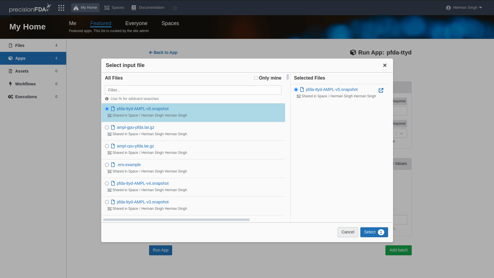
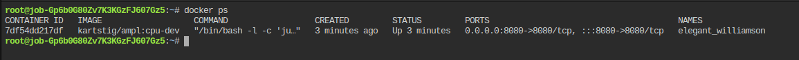

# Running AMPL on Precision FDA

## Requirements

- Account on pFDA / DNANexus
- Access to Workstations
- Access to `AMPL on pFDA` shared Space

## Running Jupyter Notebook

1. Launch the `pfda-ttyd` Workstation (located in Featured). In order to access the snapshot, select `AMPL on pFDA` for the context:




2. Wait for the Workstation to start. It takes a few minutes for it to reach the `Running` state. Click on `Open Workstation`.

3. Update `.env` with any configuration you need to adjust.

4. Run the `./start` command


**_Note:_** The start command can take ~5m to run, depending on which instance type is used. The GPU docker image is approx 8GB so it will take longer.

5. Copy the Jupyter Notebook URL. There are 2 URLs. Copy the one which has the pfda job-id host. This is the hostname which will be accessible by your current pFDA login session. Be sure to change `http` --> `https`. Enter this into the browser URL.


**_Note:_** The Precision FDA Environment has a very short lived session. If you have a slow network connection, you may be logged out before the docker images are downloaded

## Importing Existing Models

There are a couple options for importing an pre-trained model. Most models come in the form of a `.tar.gz`. The first steps will be to create a workstation using the instruction above, with the one optional inital step to copy the snapshot into your own Space. You only need to copy the snapshot if your pre-trained models exist in your own space. The goal is the have the files located in the same Space for ease of downloading. Once this workstation is running, proceed as follows:

1. Upload trained models to pFDA using the Files interface. Click on the `Add Files` button and follow the dialog to upload to pFDA.


2. In the Workstation tab, cd into a directory called `work/` by running the following:

```
cd work
```


3. Download the model to the Workstation inside the `work/` directory, and return to the home directory

```
pfda download <name_of_model.tar.gz>
cd ..
```


4. Continue from Step 5 above to run your notebook

# Updating the AMPL Snapshot on Precision FDA

There are 2 scripts which are used to help with installing and running AMPL on pFDA:

- [install_pfda](./install_pfda)
  This script was used to bootstrap the initial snapshot. The only major requirement for running pFDA is Docker. Hopefully this script should not need to updated, but in the event that it does, you will want to append any necessary commands to this script so that we can track it. Once the script has been updated, copy it from version control, and paste it into the Workstation. After running all commands, create a new snapshot with a new version.
- [start_pfda](./start_pfda)
  This is the script which is instructed to the end-user to run once they've downloaded all the files which they need for their Workstation. The purpose of this script is to download a fresh docker image and clone the latest `master` for AMPL before starting the Jupyter Notebook. Because of the way this script will call `make`, some parts can be updated in version control. Similarly to the other script, once changes have been made, a new snapshot will be necessary.

# Other Notes about pFDA

## Re-attaching to a running Workstation


PrecisionFDA has a very short lived session. If you get logged out at any point, you should be able to login again and attach to your Workstation.

1. You can safely close any tabs with an old session
2. Login to pFDA
3. Connect to the running Workstation
4. Run the following command:

```shell
docker ps
```

5.  If your output shows no running containers, it will look like this:


You can restart the notebook by running

```shell
cd AMPL/
. .env                    # Required to load configuration
make jupyter-notebook
```


Otherwise if you have a running container, your `docker ps` output will look something like this:


Then we can simply output the logs from it by running the following:
docker logs:

```
docker logs $(docker ps -q)
```

From here we can copy the URL for the Jupyter Notebook


## Creating a new snapshot

In order to provide a better user experience, there are snapshots which are meant to target specific versions of AMPL. To create a new snapshot, you can do the following:

1. Launch a Workstation using the latest dev snapshot
2. Edit the `.env` file using a text editor called `vi`


For more information on how to use Vim, see this basic tutorial: https://www.geeksforgeeks.org/basic-vim-commands/

3. Edit the ENV variable to be whichever version you'd like to snapshot.


You may need to type `i` to enter interactive mode.

4. Save you changes. To save your work, You can push `Escape` to exit interactive mode. Then you can type `:wq` to write and quit.

5. In the pFDA console, click on snapshot. Name the snapshot according to the existing naming conventions
